# LLM-Para: A Multi-Metric First-Order Roofline Analysis Framework for LLM Inference on Heterogeneous Multi-Tier Memory Architectures

<div align="center">

<!-- [ANONYMOUS REVIEW] Paper badges hidden during submission
[](paper_draft/llm_para_paper.tex)
[](paper_draft/llm_para_paper.pdf)
-->
[](https://llm-para.onrender.com)

</div>

---

[](https://www.python.org/)
[](LICENSE)
[](https://flask.palletsprojects.com/)
[](https://www.chartjs.org/)

A comprehensive **web-based analytical framework** for analyzing **computation complexity**, **memory access patterns**, **energy efficiency**, **TCO**, **carbon footprint**, and **hardware performance bottlenecks** in large Transformer-based language models. Features multi-metric Roofline analysis, heterogeneous multi-tier memory modeling, and multi-objective Design Space Exploration (DSE) with Pareto optimization.

> **Try it now →** https://llm-para.onrender.com

---

## 📄 Research Paper

This repository accompanies the following research paper:

> **LLM-Para: A Multi-Metric First-Order Roofline Analysis Framework for LLM Inference on Heterogeneous Multi-Tier Memory Architectures**
>
> Anonymous Authors
>
> **Abstract:** We present LLM-Para, a first-order analytical framework whose two principal contributions are: (1) a *heterogeneous memory-tier model* that analytically characterizes decode throughput on chiplet architectures with SRAM, DRAM, and NAND Flash tiers; and (2) a *multi-objective DSE engine* that sweeps five hardware parameters to produce Pareto-optimal configurations under performance, energy, TCO, and CO₂e objectives simultaneously. Supporting these, LLM-Para extends the classical Roofline and Energy Roofline to cover **13 operator types** across modern LLM architectures (GQA, MoE, SwiGLU, FlashAttention, RoPE, DeepSeek MLA) and **24 hardware platforms**.

<!-- [ANONYMOUS REVIEW] Paper files section hidden - paper_draft/ excluded from anonymous release
### Paper Files

| File | Description |
|:---|:---|
| [`paper_draft/llm_para_paper.tex`](paper_draft/llm_para_paper.tex) | Full LaTeX source (IEEEtran format) |
| [`paper_draft/llm_para_paper.pdf`](paper_draft/llm_para_paper.pdf) | Compiled PDF |
| [`paper_draft/figures/`](paper_draft/figures/) | All figures (PDF + PNG) |
| [`paper_draft/generate_figures.py`](paper_draft/generate_figures.py) | Figure generation script (matplotlib) |
| [`paper_draft/PAPER_DRAFT.md`](paper_draft/PAPER_DRAFT.md) | Initial draft notes |
-->

<!-- [ANONYMOUS REVIEW] Key figures section hidden - paper_draft/ excluded from anonymous release
### Key Figures from the Paper

| Classical Roofline Analysis | Energy Roofline |
|:---:|:---:|
| 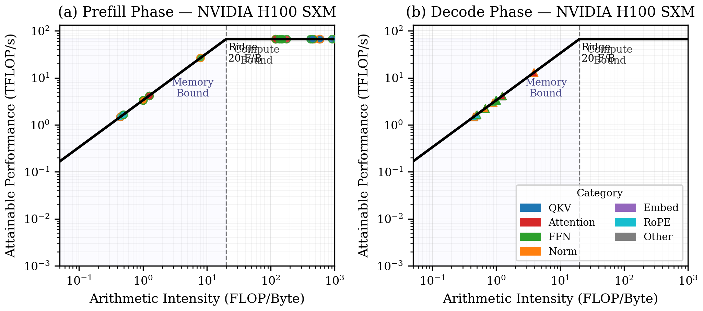 | 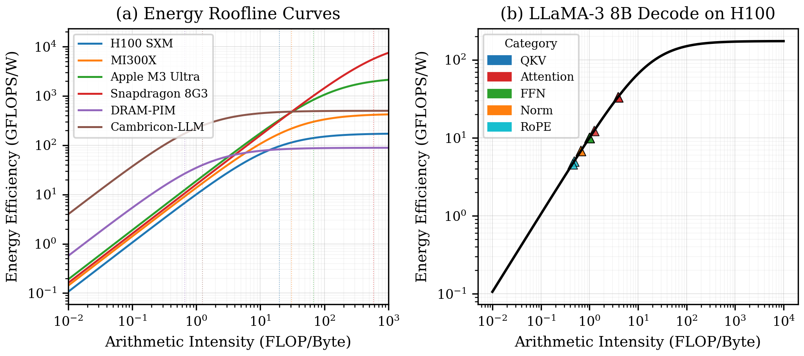 |

| Heterogeneous Architecture Throughput | DSE Pareto Frontiers |
|:---:|:---:|
| 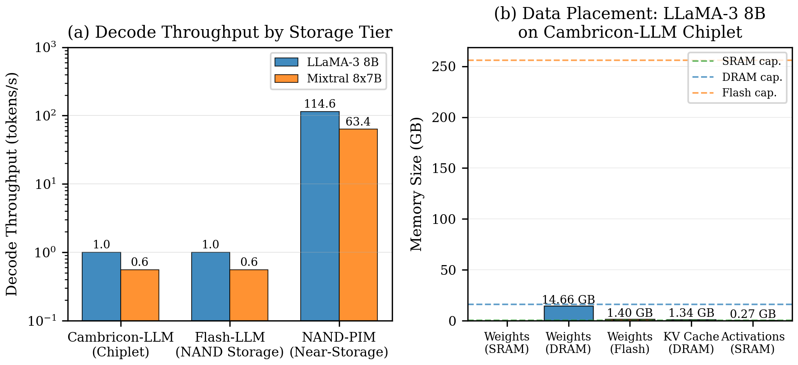 | 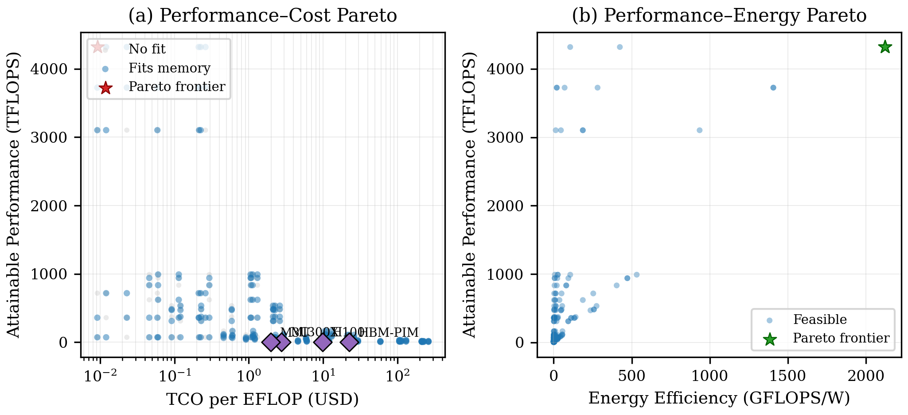 |

| FLOPs Breakdown | Memory & Quantization Impact | TCO & Carbon Footprint |
|:---:|:---:|:---:|
| 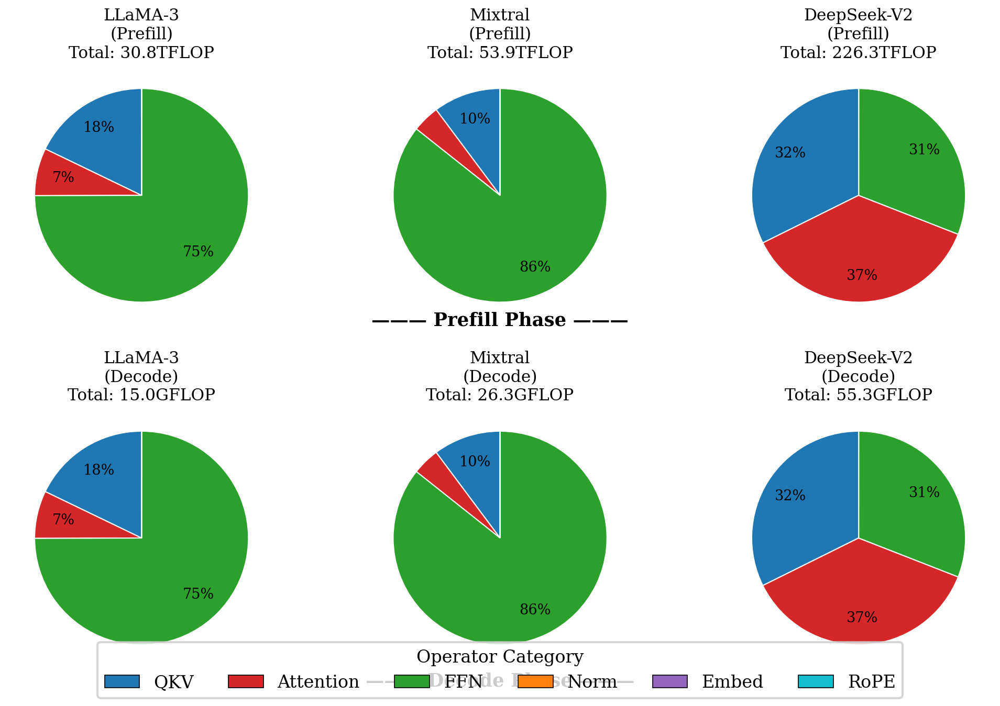 | 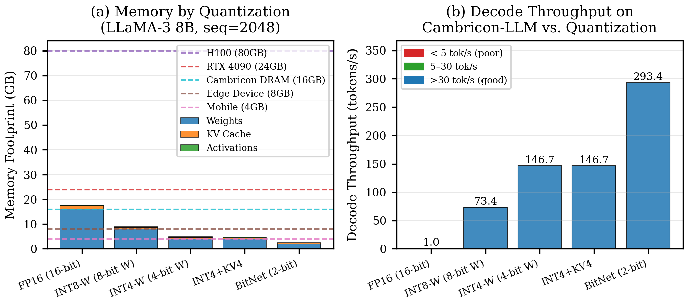 | 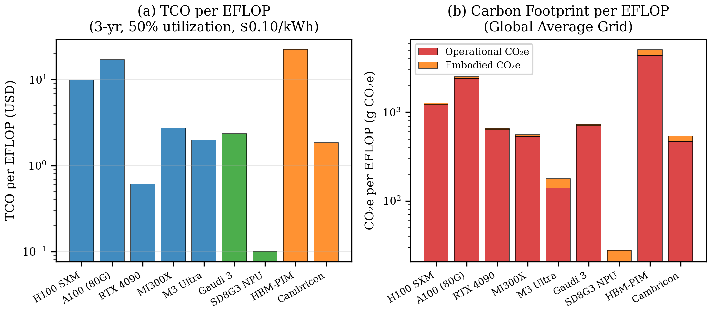 |

### Compile the Paper

```bash
cd paper_draft
pdflatex llm_para_paper.tex
pdflatex llm_para_paper.tex   # run twice for references
```
-->

### Key Findings

1. **Decode is universally memory-bound** — All decode-phase operators exhibit *I* ≤ 1 FLOP/Byte at batch size 1, regardless of architecture (GQA, MoE, MLA).
2. **MoE reduces weight traffic selectively** — Mixtral activates 2/8 experts, loading only 25% of FFN weights, but the router is the most memory-inefficient operator (*I* ≈ 0.02).
3. **MLA trades KV cache for compute** — DeepSeek-V2 MLA achieves 32× cache storage reduction at the cost of ~500× increase in per-layer attention FLOPs.
4. **Flash-bottlenecked inference** — 8B models on NAND Flash are limited to ~1 token/s; INT4 quantization enables tier migration yielding **35× throughput gain**.
5. **Near-memory sweet spot** — Configurations with BW=500–2000 GB/s, 5–20 TFLOPS achieve >20 tokens/s at <$5,000, dominating GPUs on TCO.
6. **Carbon–performance trade-off** — 10× higher throughput incurs ~50× higher carbon per EFLOP on the global average grid.

---

## 📸 Web Interface Screenshots

| Home & Configuration | Operations Table |
|:---:|:---:|
| 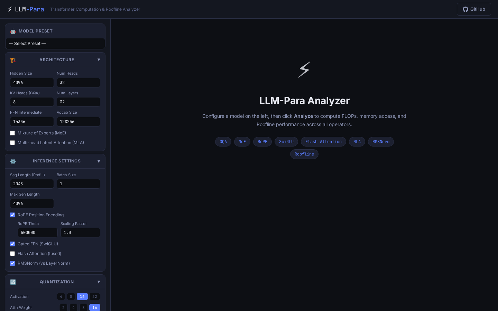 | 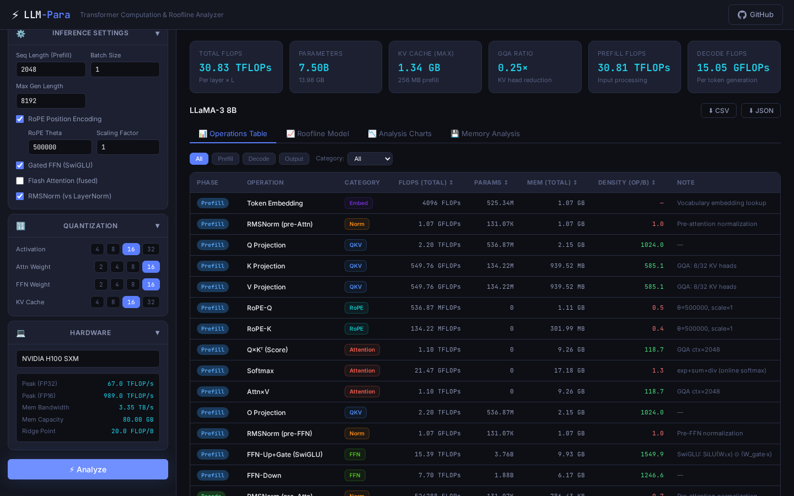 |

| Roofline Model (H100) | Analysis Charts |
|:---:|:---:|
| 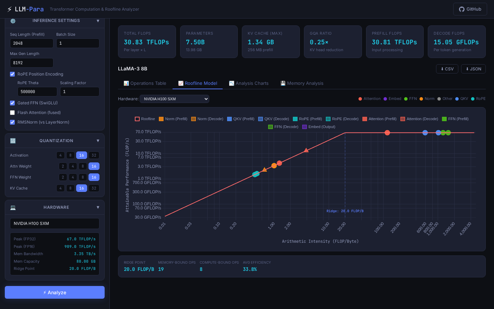 | 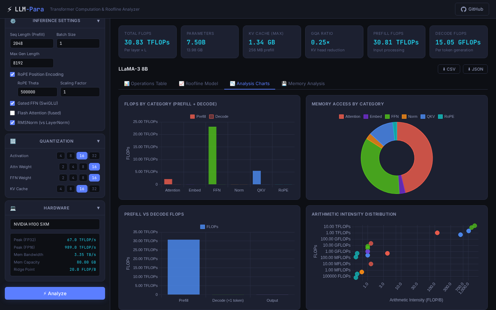 |

| Memory Analysis |
|:---:|
| 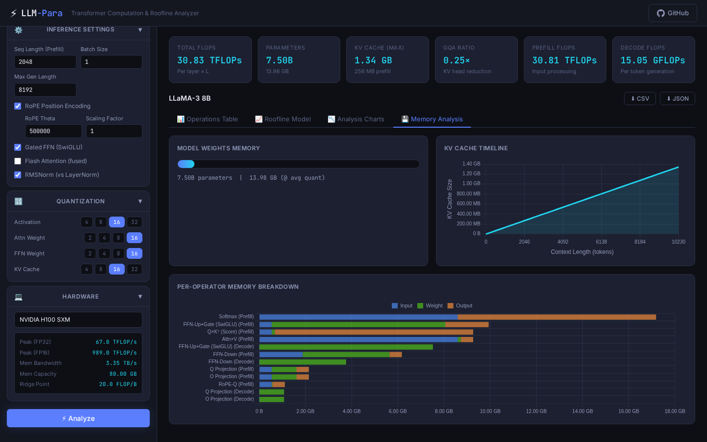 |

---

## 🚀 Features

### 📊 Comprehensive Operator Coverage
Beyond standard Transformer analysis, LLM-Para models every operator in the inference pipeline:

| Operator | Description |
|---|---|
| **Token Embedding** | Vocabulary lookup memory cost |
| **RMSNorm / LayerNorm** | Pre/post attention and FFN normalization |
| **Q / K / V Projection** | Linear projections with GQA support |
| **RoPE-Q / RoPE-K** | Rotary Position Embedding FLOPs |
| **Q×Kᵀ (Score)** | Attention score computation |
| **Softmax** | Online softmax with exp/sum/div |
| **Attn×V** | Attention output aggregation |
| **FlashAttention** | Fused kernel with reduced memory traffic |
| **O Projection** | Output attention projection |
| **MoE Router** | Expert routing gate computation |
| **MoE FFN-Up+Gate** | Sparse MoE SwiGLU up-projection |
| **MoE FFN-Down** | Sparse MoE down-projection |
| **FFN-Up+Gate (SwiGLU)** | Dense gated feed-forward |
| **FFN-Down** | Dense FFN down-projection |
| **MLA (DeepSeek)** | Multi-head Latent Attention KV compression |
| **LM Head** | Final vocabulary projection |

### 🏗️ Architecture Support
- ✅ **Grouped Query Attention (GQA)** — LLaMA-3, Mistral, Qwen2
- ✅ **Mixture of Experts (MoE)** — Mixtral, Qwen2-MoE, DeepSeek
- ✅ **Multi-head Latent Attention (MLA)** — DeepSeek-V2, DeepSeek-R1
- ✅ **Rotary Position Encoding (RoPE)** — with theta and scaling factor
- ✅ **SwiGLU / Gated FFN** — LLaMA, Mistral, Gemma
- ✅ **FlashAttention** — fused kernel memory analysis
- ✅ **RMSNorm / LayerNorm** — configurable norm type
- ✅ **Quantization** — per-component bit-widths (2/4/8/16/32-bit)

### 🖥️ Hardware Platform Library
| Category | Platforms |
|---|---|
| **NVIDIA GPU** | H100 SXM/PCIe, A100 (40/80GB), A10, RTX 4090/4080 |
| **AMD GPU** | MI300X, MI250X |
| **Apple Silicon** | M3 Ultra, M2 Ultra, M2 Max |
| **Intel** | Gaudi 3, Xeon Platinum 8480+ |
| **Mobile NPU** | Snapdragon 8 Gen 3/2, Dimensity 9300 |
| **PIM** | DRAM-PIM (HBM-PIM), NAND-PIM (HILOS), SRAM-PIM |
| **Chiplet/Hetero** | Cambricon-LLM, Flash-LLM, NAND-PIM Near-Storage, Custom Heterogeneous |
| **Multi-GPU Cluster** | 8×H100 NVLink, 4×A100 NVLink, 2×MI300X PCIe |
| **Custom** | Fully user-configurable peak perf, bandwidth, capacity, TDP, cost |

### 🌐 Web Interface
- Real-time computation with interactive parameter controls
- **Dark / Light theme** toggle with polished styling for both modes
- Interactive Roofline model chart (log-log scale, per operator)
- Per-category FLOPs and memory breakdown charts
- Arithmetic intensity scatter visualization
- KV cache timeline analysis
- Per-operator memory decomposition (input/weight/output)
- **Custom hardware parameter editing** — adjust peak perf, bandwidth, capacity, TDP, cost for Custom/PIM platforms directly in the sidebar
- **Configurable memory tiers** — edit SRAM/DRAM/Flash bandwidth, capacity, energy, latency in the Hetero Architecture tab
- CSV and JSON export

### 🔗 Multi-Chip Sharding Analysis (WIP)

> **Status: Work in Progress** — This feature is under active development.

The Multi-Chip Sharding tab models how LLM inference states are distributed across multiple devices:

| Feature | Description |
|---|---|
| **Tensor Parallelism (TP)** | Split weight matrices across devices; AllReduce after attention/FFN |
| **Pipeline Parallelism (PP)** | Split layers across pipeline stages; point-to-point activation transfer |
| **Data Parallelism (DP)** | Replicate model, partition batch across devices |
| **Communication Modeling** | Ring AllReduce `2(N-1)/N × msg_size`; overlap analysis |
| **Per-Device Memory** | Weight sharding, KV cache partitioning, activation footprint per device |
| **Scaling Curves** | Throughput vs device count with ideal baseline comparison |
| **Efficiency Analysis** | Parallel efficiency, communication overhead percentage |

Supported multi-chip configurations:
- **8×H100 NVLink** — 900 GB/s all-to-all interconnect
- **4×A100 NVLink** — 600 GB/s all-to-all interconnect
- **2×MI300X PCIe** — 64 GB/s ring topology

Key insight: Decode-phase communication is lightweight (single-token activations), enabling near-linear TP scaling. Prefill communication scales with sequence length and can become a bottleneck at high TP degrees.

## 📦 Installation

```bash
git clone https://github.com/llmpara2026/LLM-Para
cd LLM-para
pip install -r requirements.txt
```

## 🚀 Quick Start

### Web Interface
```bash
python app.py
# Open http://localhost:5000
```

### Command Line (batch analysis)
```bash
python cli.py --model "LLaMA-3 8B" --hardware "NVIDIA H100 SXM" --output results.csv
```

### Python API
```python
from analyzer import LLMAnalyzer

config = {
    "hidden_size": 4096,
    "num_heads": 32,
    "num_key_value_heads": 8,       # GQA
    "num_layers": 32,
    "intermediate_size": 14336,
    "vocab_size": 128256,
    "seq_len": 2048,
    "batch_size": 1,
    "max_gen_len": 4096,
    "use_gate_ffn": True,           # SwiGLU
    "use_rmsnorm": True,
    "rope_theta": 500000.0,         # RoPE
    "rope_scaling_factor": 1.0,
    "quant_config": {
        "activation": 16,
        "weight_attn": 16,
        "weight_ffn": 16,
        "kv_cache": 16,
        "rope_bit": 32,
    },
}

analyzer = LLMAnalyzer(config)
results = analyzer.analyze()
summary = analyzer.get_summary(results)

print(f"Total FLOPs: {summary['total_flops']:.2e}")
print(f"Parameters:  {summary['total_params']:.2e}")
print(f"Model Size:  {summary['model_size_gb']:.2f} GB")
print(f"KV Cache:    {summary['kv_max_mb']:.0f} MB (max)")

# Roofline analysis for H100
from configs import HARDWARE_CONFIGS
hw = HARDWARE_CONFIGS["NVIDIA H100 SXM"]
roofline = analyzer.get_roofline_data(results, hw)
print(f"Ridge Point: {roofline['ridge_point']:.1f} FLOP/B")
```

### MoE Example (Mixtral 8x7B)
```python
config = {
    "hidden_size": 4096,
    "num_heads": 32,
    "num_key_value_heads": 8,
    "num_layers": 32,
    "intermediate_size": 14336,
    "num_experts_per_tok": 2,        # Top-2 routing
    "num_local_experts": 8,          # 8 total experts
    "use_gate_ffn": True,
    "rope_theta": 1000000.0,
    "quant_config": {"activation": 16, "weight_attn": 16,
                     "weight_ffn": 16, "kv_cache": 16, "rope_bit": 32},
    # ... other params
}
```

### MLA Example (DeepSeek-V2)
```python
config = {
    "use_mla": True,
    "mla_kv_lora_rank": 512,
    "mla_q_lora_rank": 1536,
    "mla_qk_nope_head_dim": 128,
    "mla_qk_rope_head_dim": 64,
    "mla_v_head_dim": 128,
    # ... other params
}
```

## 📁 Project Structure

```
LLM-para/
├── app.py              # Flask web server & REST API
├── analyzer.py         # Core analysis engine (all operators)
├── configs.py          # Model & hardware preset configs
├── metrics.py          # Energy Roofline, TCO, CO₂e analysis
├── hetero.py           # Heterogeneous multi-tier memory modeling
├── dse.py              # Multi-objective Design Space Exploration
├── parallelism.py      # Multi-chip parallelism & sharding analysis (WIP)
├── cli.py              # Command-line interface
├── requirements.txt
├── README.md
├── static/
│   ├── index.html      # Web UI (9 analysis tabs)
│   ├── css/style.css   # Dark & light theme stylesheet
│   └── js/app.js       # Frontend application logic
└── docs/               # Web interface screenshots
```

## 🔌 REST API

| Method | Endpoint | Description |
|---|---|---|
| `GET` | `/api/models` | List preset model configs |
| `GET` | `/api/hardware` | List hardware platforms |
| `POST` | `/api/analyze` | Run full analysis (supports custom HW overrides) |
| `POST` | `/api/roofline` | Get roofline data for given HW |
| `POST` | `/api/export/csv` | Download results as CSV |
| `POST` | `/api/export/json` | Download results as JSON |
| `POST` | `/api/compare` | Compare multiple model configs |
| `POST` | `/api/metrics` | Energy Roofline, TCO, CO₂e analysis |
| `GET` | `/api/metrics/regions` | List CO₂ grid intensity regions |
| `POST` | `/api/hetero` | Heterogeneous memory tier analysis (supports custom tiers) |
| `GET` | `/api/hetero/hardware` | List heterogeneous hardware options |
| `POST` | `/api/parallelism` | Multi-chip parallelism analysis (WIP) |
| `GET` | `/api/parallelism/hardware` | List multi-chip hardware clusters |
| `GET` | `/api/dse/presets` | DSE sweep presets |
| `POST` | `/api/dse/run` | Run Design Space Exploration |
| `POST` | `/api/dse/sensitivity` | Single-parameter sensitivity analysis |

## 📊 Preset Model Library

| Family | Models |
|---|---|
| GPT-2 | Small (117M), XL (1.5B) |
| LLaMA-2 | 7B, 13B, 70B |
| LLaMA-3 | 8B, 70B, 405B |
| Mixtral | 8x7B, 8x22B |
| Qwen2 | 7B, 72B, MoE 57B-A14B |
| DeepSeek | V2 (MLA+MoE), R1 671B |
| Gemma-2 | 9B, 27B |
| Phi-3 | Mini (3.8B) |
| BitNet | b1.58 3B |

## 🔬 Methodology

### FLOP Counting
For a standard Transformer layer (per layer, per token in decode):

| Operation | FLOPs |
|---|---|
| Q/K/V Proj | `2 × b × s × h × h` (K/V scaled by GQA ratio) |
| RoPE | `4 × b × s × n × d/2` per Q/K |
| Q×Kᵀ | `2 × b × n × s × ctx × d` |
| Softmax | `5 × b × n × s × ctx` |
| Attn×V | `2 × b × n × s × ctx × d` |
| O Proj | `2 × b × s × h × h` |
| FFN SwiGLU | `2 × b × s × h × ffn_size × 2 + b × s × ffn_size` |
| RMSNorm | `4 × b × s × h` per norm |

### Memory Model
Memory traffic = input bytes + weight bytes + output bytes, with bit-width per component.
Arithmetic Intensity = FLOPs / Total Bytes.

### Roofline
Attainable performance = `min(intensity × BW, peak_FLOP/s)`.
Memory-bound: `intensity < ridge_point = peak / BW`.
Compute-bound: `intensity ≥ ridge_point`.

## 📄 License

MIT License — see [LICENSE](LICENSE) for details.

## 📚 Citation

If you find this work useful, please cite our paper:

```bibtex
@article{llmpara2025,
  title={LLM-Para: A Multi-Metric First-Order Roofline Analysis Framework
         for LLM Inference on Heterogeneous Multi-Tier Memory Architectures},
  author={Anonymous},
  year={2025},
  url={https://github.com/llmpara2026/LLM-Para},
  note={Source code and live demo available at
        \url{https://llm-para.onrender.com}}
}
```

## 🔗 Related Work & References

- [Roofline Model](https://people.eecs.berkeley.edu/~kubitron/cs252/handouts/papers/RooflineVyNoYellow.pdf) — Williams et al., CACM 2009
- [LLM-Viewer](https://github.com/hahnyuan/LLM-Viewer) — Yuan et al., "LLM Inference Unveiled: Survey and Roofline Model Insights", 2024
- [LLMCompass](https://github.com/PrincetonUniversity/LLMCompass) — Zhang et al., ISCA 2024
- [Energy Roofline](https://ieeexplore.ieee.org/document/8366925) — Ghane et al., ISPASS 2018
- [FlashAttention-2](https://github.com/Dao-AILab/flash-attention) — Dao, ICLR 2024
- [DeepSeek-V2 MLA](https://arxiv.org/abs/2405.04434) — DeepSeek-AI, 2024
- [Cambricon-LLM](https://arxiv.org/abs/2312.03134) — Yu et al., 2024
- [LLM in a Flash](https://arxiv.org/abs/2312.11514) — Alizadeh et al., 2023
